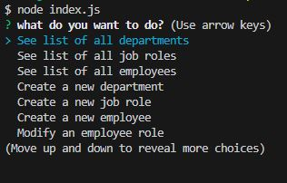

# Employee-Tracker

## This is a command-line application that allows a business owner to view and manage the departments, roles, and employees in their company. It is built with Node.js, MySQL, and the following packages

- mysql2 for connecting to the MySQL database and performing queries
- inquirer for interacting with the user via the command line
- console.table for printing MySQL rows to the console

## Installation

- Clone the repository to your local machine

- Install the necessary dependencies by running npm install

- Create the database by running the schema file in your MySQL server: employee_db.sql

- Seed the database with the following commands:

- Update the password field in server.js to match your MySQL password.

## Usage

To run the application, navigate to the root directory of the project and run npm start. This will start the application and present the user with a menu of options:

Selecting any of these options will prompt the user to enter any necessary information to complete the action.

## Links for the project

[Video Link](https://drive.google.com/file/d/13XwPX5MXs10sFAQ_Mne3hlfuwUSCcfqs/view)

[Repository](https://github.com/Fabri-Tech/Fabrizio-Trevino-Employee-Tracker)

## Contributing

Contributions are welcome! If you would like to contribute to this project, please fork the repository and submit a pull request.
